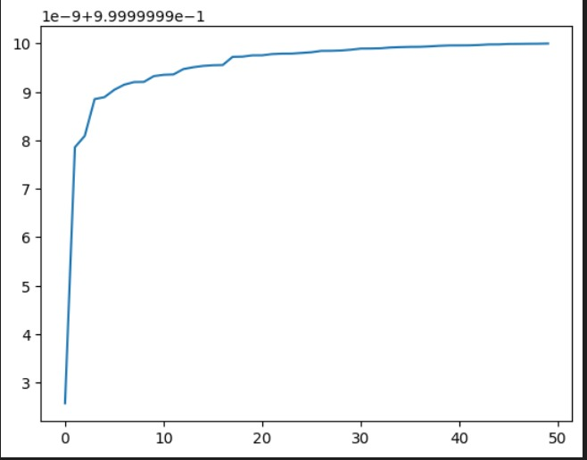
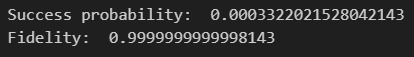

Our goal was to find the optimized unitaries to implement the gates CZ and CCZ.
We did it in the correspondent jupyter notebooks, where we used the procedure expalined in the papers. We found the matrix of permanents A and with that we calculated the Fidelity and Success probability and we maximized them (more detailes are written in the notebooks).
Then we used the numerical Unitary matrix obtained to find a linear optical circuit, using a circuit optimizer notebook in Parceval.

We did not take the circuit from a paper but we implemented the whole optimization pipeline from scratch. Our method works well for the CZ gate and recovers the same matrix proposed in the literature.
We implemented a similar calculation for the CCZ gate, in this case however, due to an error in the ordering of the Fock states when creating the circuit, the result is not the correct one.
The fidelity of the optimization procedure for the CCZ gate goes to one:

A general optimization procedure for gates in the KLM model is given in bonus.ipynb.